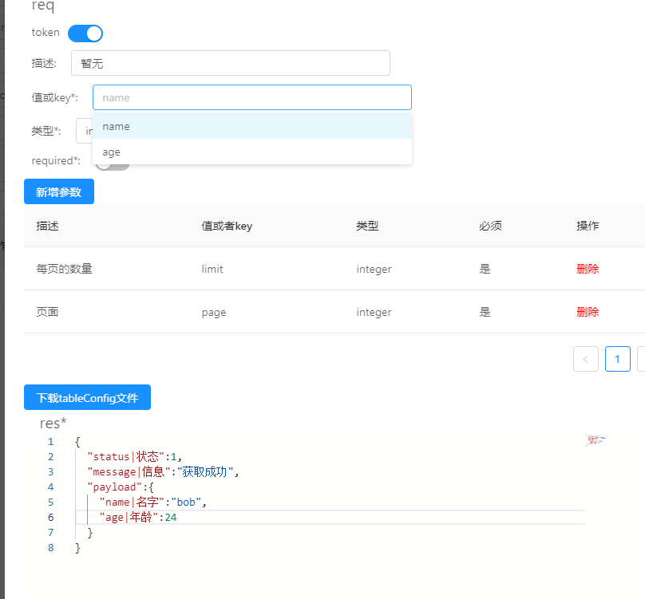

## web-api

### 目的
为了便于书写swagger格式的接口文档，降低重复编写文档强度，同时可以快速生成简易tableConfi文件

### 使用
```
git clone ~
cd 
npm i
npm start 
```


### 功能特点
- [x] 增加api
- [x] 筛选api
- [x] 修改api
- [x] 删除api
- [ ] 缓存
- [x] 快速生成简易config.json文件

### 新增api
- 点击新增路由，出现一个modal，有*符号的为必填项
- tags项为选择框，可以点击上方的新增tags来增加
- 当method为`post`、`put`等参数位于`body`中时，新增req参数中的description无效，可不填  
- 目前支持`get`、`post`、`put`、`delete`四种方法，其中get、delete参数默认位于body中，其他方法默认位于body中，暂不支持自定义参数位置
- res为可以通过JSON.parse()转换成obj的字符串，其字段为`"key|description":example`，其中，`description`字段可以不要 
- req中的新增参数可以自动补全，数据源为res的payload字段

- 新增api时，当新增的路由与方法在原数据中存在时，将会给出提示，如果不管，继续增加，将会覆盖原方法   
注：编辑与新增为同一个modal，且关闭时没有进行销毁，提供一个重置按钮，可以重置modal状态
```
{                                      
  "status|状态":1,                     
  "message|信息":"获取成功",
  "payload":{
    "name|名字": "bob",
    "age|年龄":24
  }
}
```

### 删除api
可以通过列表操作删除按钮删除对应的api与method，同时可以通过路径筛选来快速找到

### 修改api
点击编辑按钮后，可以修改api属性，大部分操作与新增类似，在修改api中，不支持修改路由与方法。  


### 缓存数据
目前没有做数据缓存

### 生产简易config.json文件
当res的payload的一级key中存在包含data(大小写均可，目前不支持多级子项，当前仅支持一个data)，且其为array，子项为object时，可以点击下载config按钮，得到简易的config.json文件，目前没有对条件进行过多的判断
```
{                                      
  "status|状态":1,                     
  "message|信息":"获取成功",
  "payload":{
    "data":[{
      "test|测试":25
    }],
    "xxData":[{
      "sdsx|asdg":256
    }]
  }
}
```

